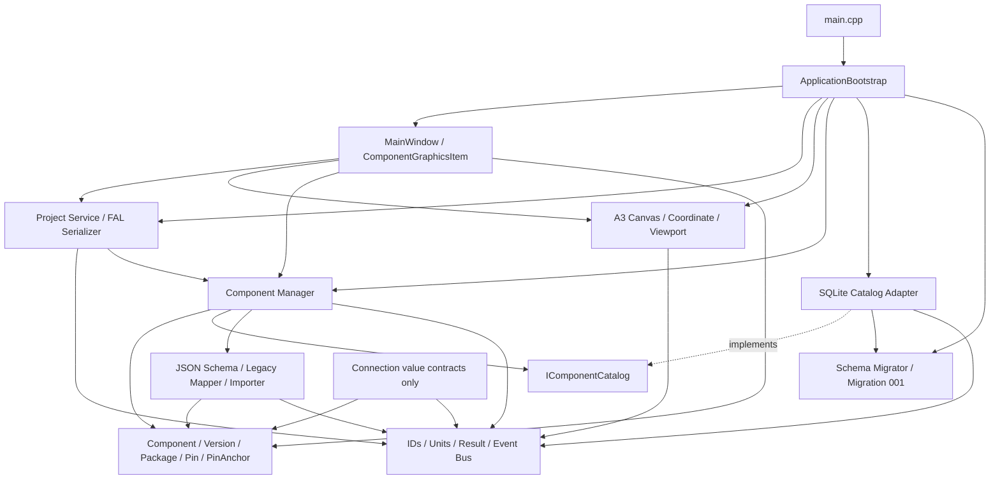

# ArduLab Clean Foundation Implementation Plan v1.0

**Status:** Proposed — awaiting approval  
**Plan type:** Clean-room Qt6/C++ foundation  
**Authoritative inputs:**

1. *ArduLab Software Architecture Document v1.0*
2. *ArduLab v0.1.3 Catalog Architecture Decision Record (ADR) v1.0*

**Rejected baseline:** The previous Qt6/C++ archive is incomplete and unreliable. No source from that archive will be copied, repaired, or treated as implementation authority.  
**Implementation authorization:** Not granted by this plan; no code is to be written until explicit approval.

---

## 1. Purpose and Scope

This plan defines a clean ArduLab foundation that preserves the approved long-term architecture while implementing only the minimum foundation needed for:

- Windows application lifecycle.
- Project management foundation.
- Backward-compatible `.FAL` loading/saving foundation.
- A3 engineering Canvas foundation.
- Coordinate conversion, zoom, and pan.
- Component object model.
- Component Manager boundary.
- PinAnchor foundation.
- SQLite initialization.
- Catalog schema migration framework.
- Component catalog foundation.
- JSON component import and schema-version handling.

This plan does not authorize implementation of schematic editing, simulation, PCB routing, manufacturing outputs, firmware generation, or AI integration.

---

## 2. Architectural Decisions for the Clean Foundation

### 2.1 Application form

- Native Windows desktop application.
- C++17 language baseline; C++20 may be enabled later through an explicit toolchain decision.
- Qt6 Core, Gui, Widgets, and Sql.
- CMake build system using Ninja.
- SQLite local catalog.
- JSON interchange.
- `.FAL` project files with additive schema evolution.

### 2.2 Architectural style

The clean foundation is a modular desktop monolith with explicit module boundaries:

```text
UI adapters
    ↓
Application services
    ↓
Domain modules
    ↓
Persistence and format ports
```

The executable is one process, but no module may use `MainWindow` as a service locator or domain coordinator.

### 2.3 Clean-room rule

- Do not copy source from the incomplete archive.
- Do not reproduce undocumented behavior from the incomplete archive.
- Preserve only the approved concepts and contracts from the two authoritative documents.
- Every implemented feature must have a named owner module and a testable boundary.

---

## 3. Proposed Project Structure

The following is the exact planned source structure. Names use consistent lower-case directories and PascalCase C++ types.

```text
ArduLab/
├── CMakeLists.txt
├── cmake/
│   └── ArduLabWarnings.cmake
├── resources/
│   ├── ardulab.qrc
│   ├── catalog/
│   │   └── categories.v1.json
│   └── examples/
│       ├── LegacyEmptyProject.FAL
│       └── Resistor.schema-1.0.json
├── src/
│   ├── main.cpp
│   ├── app/
│   │   ├── ApplicationBootstrap.h
│   │   └── ApplicationBootstrap.cpp
│   ├── core/
│   │   ├── Result.h
│   │   ├── Error.h
│   │   ├── Identifiers.h
│   │   ├── Units.h
│   │   ├── Event.h
│   │   ├── EventBus.h
│   │   └── EventBus.cpp
│   ├── project/
│   │   ├── Project.h
│   │   ├── Project.cpp
│   │   ├── ProjectMetadata.h
│   │   ├── ProjectService.h
│   │   ├── ProjectService.cpp
│   │   ├── FalDocument.h
│   │   ├── FalSerializer.h
│   │   └── FalSerializer.cpp
│   ├── canvas/
│   │   ├── A3CanvasScene.h
│   │   ├── A3CanvasScene.cpp
│   │   ├── A3CanvasView.h
│   │   ├── A3CanvasView.cpp
│   │   ├── CoordinateSystem.h
│   │   ├── CoordinateSystem.cpp
│   │   ├── ViewportController.h
│   │   └── ViewportController.cpp
│   ├── components/
│   │   ├── Component.h
│   │   ├── ComponentVersion.h
│   │   ├── ComponentParameter.h
│   │   ├── Package.h
│   │   ├── Pin.h
│   │   ├── PinAnchor.h
│   │   ├── ComponentSnapshot.h
│   │   ├── ComponentSearchCriteria.h
│   │   ├── IComponentCatalog.h
│   │   ├── IComponentManager.h
│   │   ├── ComponentManager.h
│   │   └── ComponentManager.cpp
│   ├── database/
│   │   ├── CatalogDatabase.h
│   │   ├── CatalogDatabase.cpp
│   │   ├── CatalogPaths.h
│   │   ├── CatalogPaths.cpp
│   │   ├── CatalogTransaction.h
│   │   ├── CatalogTransaction.cpp
│   │   ├── SchemaMigration.h
│   │   ├── SchemaMigrationRegistry.h
│   │   ├── SchemaMigrationRegistry.cpp
│   │   ├── SchemaMigrator.h
│   │   ├── SchemaMigrator.cpp
│   │   ├── SqliteComponentCatalog.h
│   │   ├── SqliteComponentCatalog.cpp
│   │   ├── migrations/
│   │   │   ├── Migration001InitialCatalog.h
│   │   │   └── Migration001InitialCatalog.cpp
│   │   └── import/
│   │       ├── ComponentJsonDocument.h
│   │       ├── ComponentJsonImporter.h
│   │       ├── ComponentJsonImporter.cpp
│   │       ├── ComponentJsonSchema.h
│   │       ├── ComponentJsonSchema.cpp
│   │       ├── LegacyComponentMapper.h
│   │       └── LegacyComponentMapper.cpp
│   ├── connection/
│   │   ├── CatalogPinRef.h
│   │   ├── ConnectionPoint.h
│   │   ├── Wire.h
│   │   ├── Net.h
│   │   └── README.md
│   └── ui/
│       ├── MainWindow.h
│       ├── MainWindow.cpp
│       ├── ComponentGraphicsItem.h
│       └── ComponentGraphicsItem.cpp
└── tests/
    ├── CMakeLists.txt
    ├── core/
    │   └── EventBusTests.cpp
    ├── project/
    │   └── FalCompatibilityTests.cpp
    ├── canvas/
    │   └── CoordinateSystemTests.cpp
    ├── components/
    │   ├── ComponentManagerTests.cpp
    │   └── PinAnchorTests.cpp
    ├── database/
    │   ├── CatalogDatabaseTests.cpp
    │   ├── SchemaMigratorTests.cpp
    │   └── ComponentJsonImporterTests.cpp
    └── fixtures/
        ├── legacy-empty-project.FAL
        ├── legacy-esp32.json
        ├── canonical-resistor-1.0.json
        └── unsupported-schema.json
```

### 3.1 Directory ownership

| Directory | Owner | Allowed dependencies |
|---|---|---|
| `app` | Composition root | All implemented module interfaces |
| `core` | Shared foundational types | Standard C++ and minimal Qt Core value adapters |
| `project` | Project domain and `.FAL` | `core`, component reference value types |
| `canvas` | Engineering workspace | `core`, Qt Gui/Widgets |
| `components` | Component domain and manager contracts | `core`; catalog interface only |
| `database` | SQLite and JSON adapters | `core`, `components`, Qt Core/Sql |
| `connection` | Future electrical relationship domain | `core`, stable component pin references only |
| `ui` | Qt presentation | Application/domain interfaces, Canvas, immutable snapshots |
| `tests` | Boundary and regression verification | Public interfaces of tested modules |

---

## 4. Initial Modules and Class Responsibilities

## 4.1 Application lifecycle

### `main.cpp`

- Construct `QApplication`.
- Delegate composition to `ApplicationBootstrap`.
- Enter the Qt event loop.
- Contain no catalog, project, or Canvas business logic.

### `ApplicationBootstrap`

- Create the catalog path and database adapter.
- Run catalog initialization and pending migrations before catalog use.
- Construct `ComponentManager` with `IComponentCatalog`.
- Construct Project Service, Canvas, and Main Window.
- Inject interfaces into consumers.
- Report startup errors without placing recovery logic in Main Window.

## 4.2 Core Engine

### `Result` and `Error`

- Provide explicit success/failure return contracts.
- Carry stable error code, message, and optional context.
- Prevent database exceptions or raw Qt SQL errors from leaking into UI/domain interfaces.

### `Identifiers`

- Define distinct IDs for component, component version, project instance, pin, package, project, and net.
- Prevent accidental interchange of catalog IDs and project IDs.

### `Units`

- Define millimeter-based position and dimensions.
- Keep screen pixels/scene units separate from physical engineering values.

### `EventBus`

- Publish typed application/domain notifications.
- Avoid direct widget-to-widget or database-to-renderer calls.
- Start with synchronous in-process delivery; threading changes require a later decision.

## 4.3 Project foundation

### `Project` and `ProjectMetadata`

- Represent project identity, name, format version, component instances, and preserved extension data.
- Keep project data independent of `QGraphicsScene` and SQL rows.

### `ProjectService`

- Create, open, save, and close a project.
- Resolve catalog references through Component Manager without silently upgrading versions.
- Publish project lifecycle events.

### `FalDocument`

- Represent the transport-level JSON document separately from the Project domain object.
- Preserve unknown additive fields for safe round trips where possible.

### `FalSerializer`

- Read the legacy minimal `.FAL` shape.
- Write a versioned additive `.FAL` document.
- Treat absent future sections as empty defaults.
- Preserve existing component instance IDs and unknown fields.
- Report unresolved catalog references; never substitute another component version automatically.

## 4.4 Canvas Engine

### `A3CanvasScene`

- Own a 420 mm × 297 mm engineering scene boundary.
- Contain presentation items, not project domain ownership.

### `A3CanvasView`

- Present the scene.
- Forward pan/zoom input to `ViewportController`.
- Avoid catalog and project persistence logic.

### `CoordinateSystem`

- Convert millimeters to scene units and back.
- Define the A3 origin and coordinate orientation.
- Remain deterministic and unit-testable without a visible window.

### `ViewportController`

- Apply bounded zoom and pan.
- Keep viewport state separate from physical component coordinates.
- Never write display scale into component/package engineering dimensions.

## 4.5 Component Engine foundation

### `Component`

- Define stable logical component identity, name, category, manufacturer/part references, lifecycle state, catalog scope, and active version.

### `ComponentVersion`

- Define immutable schema version, semantic component version, content hash, provenance, and validation state.

### `ComponentParameter`

- Represent typed engineering parameters and units for future ERC/simulation use.

### `Package`

- Represent package identity, type, dimensions, pin count, and pitch in millimeters.

### `Pin`

- Represent stable pin number/name, type, direction, electrical properties, and position.

### `PinAnchor`

- Represent the electrical connection anchor in component-local millimeter coordinates.
- Remain a value object; it does not create wires, points, or nets.
- Supply the future Connection Core handoff contract.

### `ComponentSnapshot`

- Immutable aggregate returned to UI, Renderer, PinAnchor consumers, and future engines.
- Prevent consumers from retaining mutable database records or raw SQL objects.

### `IComponentCatalog`

- Persistence port used by Component Manager.
- Define initialization-independent catalog operations such as exact load, search, and transactional import storage.
- Hide SQLite and Qt SQL from Component Engine.

### `IComponentManager`

- Application-facing component service contract.
- Define load/search/import/schema/report responsibilities without exposing storage details.

### `ComponentManager`

- Implement `IComponentManager` using `IComponentCatalog` and JSON import services.
- Load exact component versions.
- Search catalog metadata.
- Return immutable snapshots.
- Reject silent component version substitution.
- Remain independent of Renderer, Canvas, Connection Core, and Main Window.

## 4.6 Database Layer

### `CatalogPaths`

- Resolve `%LOCALAPPDATA%\ArduLab\catalog\ardulab_catalog.sqlite3`.
- Create required per-user directories.
- Never depend on the current working directory.

### `CatalogDatabase`

- Own SQLite connection lifecycle.
- Enable foreign keys and approved connection pragmas.
- Expose migration and transaction entry points to database adapters only.
- Prevent ad hoc SQL connections in UI modules.

### `CatalogTransaction`

- Provide explicit commit/rollback ownership.
- Guarantee rollback if a transaction exits unsuccessfully.

### `SchemaMigration`

- Define migration ID, checksum/description, and apply responsibility.
- Contain no UI behavior.

### `SchemaMigrationRegistry`

- Return immutable migrations in numeric order.
- Reject duplicate IDs.

### `SchemaMigrator`

- Read current catalog schema version.
- Apply pending migrations transactionally.
- Record migration ID, checksum, application version, and timestamp.
- Refuse unknown/newer database schemas.

### `Migration001InitialCatalog`

- Create initial metadata, components, component versions, categories, manufacturers, packages, pins, and applied-migrations tables required for the foundation.
- Seed approved system category codes.
- Avoid future Schematic, Simulation, PCB, or AI tables beyond references required by the approved catalog contract.

### `SqliteComponentCatalog`

- Implement `IComponentCatalog`.
- Convert database records to immutable component snapshots.
- Use prepared queries and explicit transactions.
- Enforce exact `(catalog scope, component ID, component version)` resolution.

## 4.7 JSON import layer

### `ComponentJsonDocument`

- Transport model for parsed JSON and retained raw/provenance fields.

### `ComponentJsonSchema`

- Recognize `schema_version` and `component_schema_version`.
- Support canonical `1.0` and explicitly recognized legacy documents.
- Reject unsupported major versions with actionable errors.

### `LegacyComponentMapper`

- Map legacy `id`, `name`, `class`, `value`, `visual`, and pin fields without inventing missing engineering data.
- Preserve legacy IDs through alias/provenance strategy.
- Produce warnings for uncertain units, missing pin numbers, or incomplete package data.

### `ComponentJsonImporter`

- Parse JSON.
- Detect schema version.
- Delegate legacy mapping.
- Produce a catalog candidate and import report.
- Store only through the Component Manager/catalog transaction path.
- Create DRAFT records for incomplete imports.

## 4.8 Connection Core foundation boundary

Connection Core is protected as an independent future module. Only value contracts are planned now:

- `CatalogPinRef`: scope + component ID + version ID + pin number.
- `ConnectionPoint`, `Wire`, and `Net`: declarations/placeholders documenting future ownership.
- `connection/README.md`: boundary rules and explicit statement that no connection behavior is implemented in this phase.

No wire editing, net construction, junction behavior, or graph algorithm is included in this foundation phase.

## 4.9 UI and Renderer adapter

### `MainWindow`

- Compose menus, docks, central Canvas view, and status presentation.
- Forward user intent to Project Service and Component Manager.
- Contain no SQL, JSON migration, `.FAL` parsing, or component validation logic.

### `ComponentGraphicsItem`

- Render an immutable `ComponentSnapshot`.
- Convert physical geometry through Coordinate System.
- Read PinAnchor values without changing them.
- Never query SQLite directly.
- Never own component or project persistence.

---

## 5. Protected Architecture

The following boundaries must remain independent throughout implementation:

| Module | Must not depend on | Contract boundary |
|---|---|---|
| Component Engine | SQLite, Main Window, Renderer, Connection implementation | `IComponentCatalog`, immutable snapshots |
| Connection Core | SQL rows, Renderer, Schematic UI | `CatalogPinRef`, Pin/PinAnchor snapshots |
| Schematic Engine | Database implementation, PCB, AI | Future Connection Core graph and symbol contracts |
| Simulation Engine | Renderer, SQL, PCB UI | Future connectivity snapshot and model contracts |
| PCB Engine | Schematic graphics, SQL rows, AI | Future netlist and footprint snapshots |
| AI Engine | Direct database mutation, UI ownership | Future proposal/validation port only |

### Explicitly not implemented

- Schematic editor, symbol editor, wire editing, junctions, net labels, or ERC.
- Circuit solver, SPICE integration, behavior simulation, or MCU co-simulation.
- PCB board editor, placement, routing, DRC, Gerber, or drill export.
- Manufacturing BOM or pick-and-place generation.
- Firmware generator or toolchain integration.
- Local or remote AI integration.

---

## 6. Planned File Classification

Because this is a clean-room project and the prior source is rejected, all implementation files listed below would be new after approval.

### 6.1 New files

All files in the project tree in Section 3 are new. The implementation batch is divided into required and contract-only files.

#### Required build/runtime files

```text
CMakeLists.txt
cmake/ArduLabWarnings.cmake
resources/ardulab.qrc
resources/catalog/categories.v1.json
resources/examples/LegacyEmptyProject.FAL
resources/examples/Resistor.schema-1.0.json
src/main.cpp
src/app/ApplicationBootstrap.h
src/app/ApplicationBootstrap.cpp
src/core/Result.h
src/core/Error.h
src/core/Identifiers.h
src/core/Units.h
src/core/Event.h
src/core/EventBus.h
src/core/EventBus.cpp
src/project/Project.h
src/project/Project.cpp
src/project/ProjectMetadata.h
src/project/ProjectService.h
src/project/ProjectService.cpp
src/project/FalDocument.h
src/project/FalSerializer.h
src/project/FalSerializer.cpp
src/canvas/A3CanvasScene.h
src/canvas/A3CanvasScene.cpp
src/canvas/A3CanvasView.h
src/canvas/A3CanvasView.cpp
src/canvas/CoordinateSystem.h
src/canvas/CoordinateSystem.cpp
src/canvas/ViewportController.h
src/canvas/ViewportController.cpp
src/components/Component.h
src/components/ComponentVersion.h
src/components/ComponentParameter.h
src/components/Package.h
src/components/Pin.h
src/components/PinAnchor.h
src/components/ComponentSnapshot.h
src/components/ComponentSearchCriteria.h
src/components/IComponentCatalog.h
src/components/IComponentManager.h
src/components/ComponentManager.h
src/components/ComponentManager.cpp
src/database/CatalogDatabase.h
src/database/CatalogDatabase.cpp
src/database/CatalogPaths.h
src/database/CatalogPaths.cpp
src/database/CatalogTransaction.h
src/database/CatalogTransaction.cpp
src/database/SchemaMigration.h
src/database/SchemaMigrationRegistry.h
src/database/SchemaMigrationRegistry.cpp
src/database/SchemaMigrator.h
src/database/SchemaMigrator.cpp
src/database/SqliteComponentCatalog.h
src/database/SqliteComponentCatalog.cpp
src/database/migrations/Migration001InitialCatalog.h
src/database/migrations/Migration001InitialCatalog.cpp
src/database/import/ComponentJsonDocument.h
src/database/import/ComponentJsonImporter.h
src/database/import/ComponentJsonImporter.cpp
src/database/import/ComponentJsonSchema.h
src/database/import/ComponentJsonSchema.cpp
src/database/import/LegacyComponentMapper.h
src/database/import/LegacyComponentMapper.cpp
src/ui/MainWindow.h
src/ui/MainWindow.cpp
src/ui/ComponentGraphicsItem.h
src/ui/ComponentGraphicsItem.cpp
```

#### Contract-only Connection files

```text
src/connection/CatalogPinRef.h
src/connection/ConnectionPoint.h
src/connection/Wire.h
src/connection/Net.h
src/connection/README.md
```

These define boundaries only and contain no Connection Core algorithms.

#### Test files

```text
tests/CMakeLists.txt
tests/core/EventBusTests.cpp
tests/project/FalCompatibilityTests.cpp
tests/canvas/CoordinateSystemTests.cpp
tests/components/ComponentManagerTests.cpp
tests/components/PinAnchorTests.cpp
tests/database/CatalogDatabaseTests.cpp
tests/database/SchemaMigratorTests.cpp
tests/database/ComponentJsonImporterTests.cpp
tests/fixtures/legacy-empty-project.FAL
tests/fixtures/legacy-esp32.json
tests/fixtures/canonical-resistor-1.0.json
tests/fixtures/unsupported-schema.json
```

### 6.2 Modified files

```text
None.
```

There is no accepted implementation baseline to modify. The authoritative architecture Markdown documents remain unchanged unless a later architecture amendment is approved.

### 6.3 Protected/unchanged files and concepts

#### Documents

```text
ArduLab Software Architecture Document v1.0.md
ArduLab v0.1.3 Catalog Architecture Decision Record (ADR) v1.0.md
```

#### Protected concepts

- Core Engine independence.
- A3 Canvas and millimeter coordinate authority.
- Component Engine independence.
- Component Renderer as a projection only.
- PinAnchor as a stable value contract.
- Connection Core as an independent future electrical layer.
- `.FAL` additive backward compatibility.
- JSON import/export role.
- SQLite internal catalog role.

---

## 7. Dependency Graph



### Forbidden dependency edges

```text
Component Domain ─X→ SQLite
Component Renderer ─X→ SQLite
MainWindow ─X→ SQL or JSON parsing
Canvas ─X→ Project persistence
Connection Core ─X→ Component Renderer
Database ─X→ UI
AI/Schematic/Simulation/PCB ─X→ current foundation (not implemented)
```

---

## 8. Regression Protection

## 8.1 Component Renderer continuity

The clean foundation has no trustworthy renderer implementation to preserve byte-for-byte. The approved renderer behavior is preserved architecturally:

- `ComponentGraphicsItem` accepts an immutable `ComponentSnapshot`.
- Geometry is read from Package/Pin/PinAnchor domain values.
- Coordinate conversion is delegated to `CoordinateSystem`.
- Renderer does not query the database.
- Renderer does not mutate Component objects.
- Changing SQLite schema does not change the Renderer interface.

Regression tests will construct snapshots in memory, without SQLite, and verify that the Renderer can be instantiated from the same public contract used by Component Manager.

## 8.2 PinAnchor stability

- `PinAnchor` is a component-local millimeter value object.
- It has no SQL, JSON, scene, wire, or net behavior.
- JSON/database adapters map to it; they do not define it.
- Component Manager returns it unchanged inside `ComponentSnapshot`.
- Connection Core will later reference it through `CatalogPinRef` and immutable pin snapshots.

Tests verify import → database → load round trips preserve pin number and anchor coordinates exactly.

## 8.3 `.FAL` backward compatibility

- Legacy documents containing only `project` and `components` remain readable.
- Missing format/catalog/connection sections receive safe defaults.
- Unknown fields are preserved where safe.
- Catalog references are additive and optional.
- Missing exact catalog versions produce unresolved references, not silent replacement.
- A fallback display snapshot may be retained in future versioned `.FAL` references but is not an editable second catalog.
- Save/open round-trip tests use a frozen legacy fixture.

## 8.4 Database isolation

- Tests use temporary SQLite files.
- Failed imports roll back entirely.
- Migration tests verify repeated startup does not reapply Migration 001.
- Application startup refuses a newer unsupported catalog schema.
- The user catalog path is never used by automated tests.

---

## 9. Step-by-Step Implementation Sequence

No step starts until this plan is approved.

### Step 1 — Build skeleton

Create CMake targets, Qt6 dependency declarations, warning policy, resource target, test target, and empty module directories. Verify a minimal Windows Qt executable and test binary configure/build with Ninja.

### Step 2 — Core value contracts

Implement Result/Error, distinct identifiers, millimeter units, and synchronous EventBus. Add unit tests before other modules depend on them.

### Step 3 — Component domain

Implement immutable/value-oriented Component, ComponentVersion, Package, Pin, PinAnchor, parameters, scope/lifecycle, snapshots, and search criteria. No SQL or rendering dependencies.

### Step 4 — Catalog port and manager skeleton

Define `IComponentCatalog`, `IComponentManager`, and Component Manager. Use a test double to validate exact version loading, search delegation, and immutable snapshots before SQLite exists.

### Step 5 — Catalog path and connection

Implement per-user CatalogPaths, SQLite connection ownership, required pragmas, transaction guard, and error translation. Add temporary-database tests.

### Step 6 — Migration framework

Implement migration abstraction, registry, migrator, applied-migration metadata, checksum behavior, transactional apply, and unsupported-newer-schema rejection.

### Step 7 — Initial catalog migration

Implement Migration 001 for foundation tables and category seed data. Verify table/constraint/index existence, foreign keys, idempotent startup, and rollback on failure.

### Step 8 — SQLite catalog adapter

Implement exact component/version load and basic search through prepared queries. Map rows to domain snapshots. Do not add UI-specific queries.

### Step 9 — JSON schema and legacy mapping

Implement canonical `1.0` detection, unsupported-version rejection, legacy mapping, warning reports, and preservation of missing/uncertain engineering fields as DRAFT.

### Step 10 — Transactional JSON import

Connect ComponentJsonImporter to Component Manager and the catalog adapter. Verify complete rollback on error, deterministic content hash, and duplicate/import policy.

### Step 11 — Project and `.FAL` foundation

Implement Project domain, FalDocument, serializer, and service. Verify current minimal `.FAL` opens and re-saves without losing metadata. Add optional exact catalog-reference parsing without automatic upgrades.

### Step 12 — Canvas foundation

Implement A3 scene, Coordinate System, view, and viewport controller. Verify physical dimensions and zoom/pan independence from engineering coordinates.

### Step 13 — UI composition and Renderer adapter

Build a thin Main Window with A3 Canvas and minimal catalog/project commands. Render in-memory and catalog-loaded snapshots through ComponentGraphicsItem. Do not add unapproved editor features.

### Step 14 — Connection boundary contracts

Add CatalogPinRef and documentation/value declarations only. Verify no wire/net algorithms or Schematic dependencies were introduced.

### Step 15 — End-to-end foundation verification

Validate startup → database creation → Migration 001 → JSON import → exact component load → immutable snapshot → renderer display → legacy `.FAL` open/save.

### Step 16 — Release-readiness review

Compare the implementation against both architecture documents, inventory all actual files/dependencies, record known deviations, and obtain approval before expanding v0.1.3 beyond the foundation.

---

## 10. Testing Strategy

### 10.1 Unit tests

- ID type separation.
- Millimeter/scene coordinate conversion.
- PinAnchor equality and coordinate preservation.
- Schema version parsing.
- Legacy field mapping and warnings.
- Migration ordering and duplicate-ID rejection.
- Component Manager exact-version behavior.

### 10.2 Database integration tests

- Create a new temporary catalog.
- Apply Migration 001 once.
- Reopen without reapplying it.
- Verify foreign keys and uniqueness constraints.
- Commit successful import.
- Roll back failed import.
- Reject unsupported future schema.
- Preserve stable component IDs and version hashes.

### 10.3 Project compatibility tests

- Open the legacy empty `.FAL` fixture.
- Default absent format/catalog sections safely.
- Preserve project name/version and unknown fields.
- Save and reopen without semantic loss.
- Preserve unresolved component references.
- Never silently upgrade a referenced component version.

### 10.4 UI/Canvas smoke tests

- Start application with an empty new catalog.
- Display a 420 mm × 297 mm A3 workspace.
- Zoom and pan without changing model coordinates.
- Import a canonical resistor JSON through the approved service path.
- Load and render its immutable snapshot.
- Show startup/import errors without crashing or exposing SQL internals.

### 10.5 Architectural tests/reviews

- Component domain builds without Qt Sql/Widgets linkage.
- Database target has no dependency on UI.
- Main Window contains no SQL or JSON parsing.
- Renderer accepts snapshots and has no catalog dependency.
- Connection directory has no Schematic/Simulation/PCB implementation.
- No AI SDK, network client, SPICE, PCB, or manufacturing dependency exists.

### 10.6 Acceptance matrix

| Criterion | Observable result |
|---|---|
| Clean Windows foundation | CMake/Ninja builds native Qt6 application and tests |
| Catalog initialization | First run creates local SQLite database and Migration 001 metadata |
| Schema handling | Canonical 1.0 imports; unsupported major version is rejected clearly |
| Legacy JSON | Legacy fixture imports as DRAFT with warnings and no invented fields |
| Component Manager | Exact version search/load returns immutable snapshot |
| Renderer isolation | Snapshot renders without SQL access |
| PinAnchor preservation | Import/store/load retains millimeter anchor values |
| `.FAL` compatibility | Legacy fixture opens/saves with no semantic loss |
| Scope protection | No Schematic, Simulation, PCB, Manufacturing, Firmware, or AI feature exists |

---

## 11. Dependencies

### Required

- C++17-capable Windows compiler.
- CMake.
- Ninja.
- Qt6 Core.
- Qt6 Gui.
- Qt6 Widgets.
- Qt6 Sql with SQLite driver.
- Qt6 Test for automated tests.

### Explicitly excluded

- Network/database server.
- AI SDK/provider.
- SPICE engine.
- MCU emulator.
- PCB/Gerber library.
- Schematic library.
- Additional JSON library unless an approved implementation review proves Qt JSON insufficient.

---

## 12. Implementation Risks

| Risk | Protection |
|---|---|
| Rebuilding too much at once | Follow vertical sequence and stop at foundation acceptance |
| Main Window gains domain logic | Bootstrap/services own composition and use cases |
| Database leaks into components/UI | `IComponentCatalog` and immutable snapshots |
| Legacy data is guessed | DRAFT + warnings; never invent pins/units |
| `.FAL` compatibility breaks | Frozen legacy fixture and additive parsing |
| Display scale corrupts physical data | Millimeter value types and Coordinate System tests |
| Connection Core implemented prematurely | Contract-only files and architecture review |
| Source plan expands into future engines | Explicit dependency exclusions and acceptance matrix |

---

## 13. Approval Gate

Implementation must not begin until the architecture owner approves:

- [ ] Clean-room approach.
- [ ] Exact project structure.
- [ ] Class responsibilities.
- [ ] New-file inventory.
- [ ] No modified legacy source files.
- [ ] Protected module boundaries.
- [ ] Component Renderer snapshot contract.
- [ ] PinAnchor value contract.
- [ ] `.FAL` compatibility strategy.
- [ ] Implementation sequence.
- [ ] Testing and acceptance matrix.
- [ ] Explicit exclusion of future engines.

### Approval statement to authorize the next phase

```text
ArduLab Clean Foundation Implementation Plan v1.0 APPROVED.
Proceed with the approved implementation scope only.
```

Until that statement or equivalent explicit approval is received, this plan remains documentation only.
