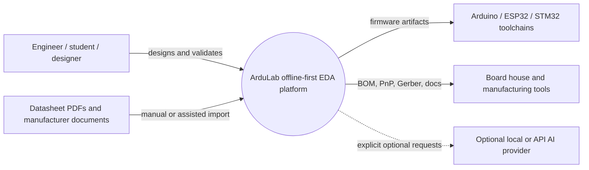
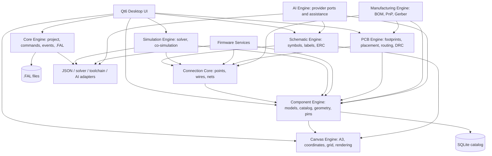
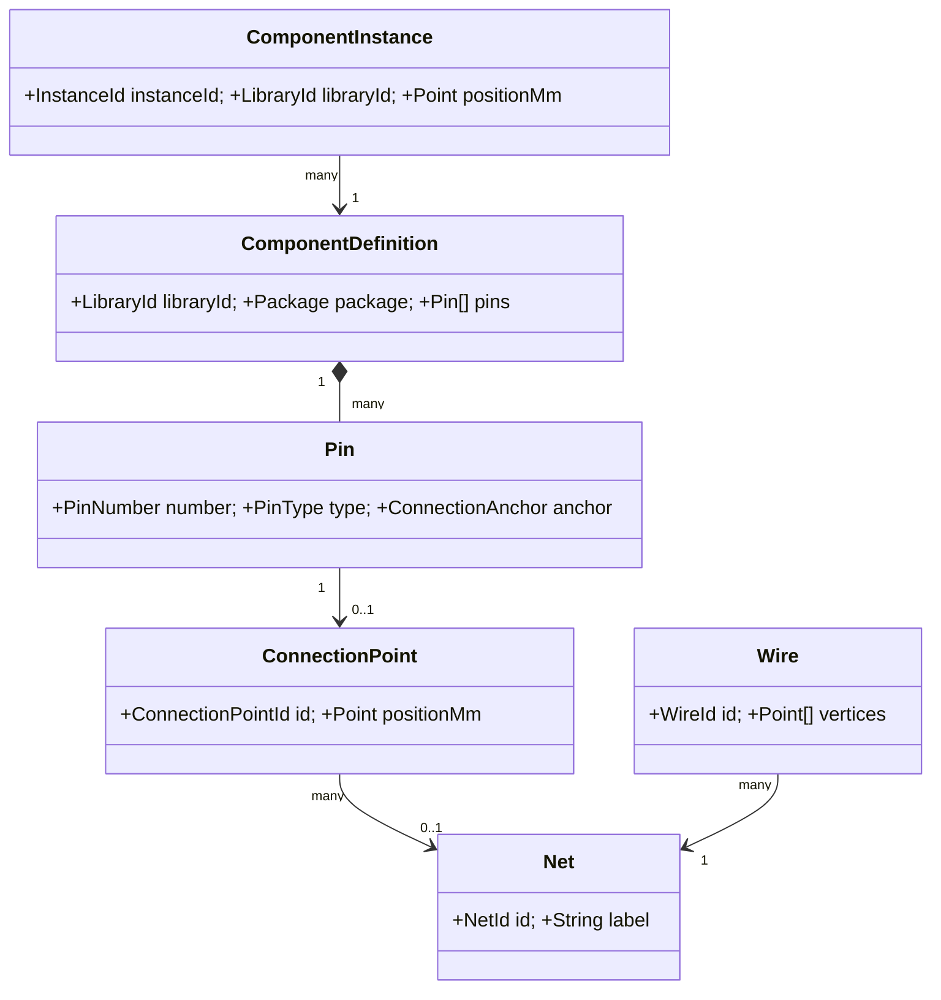
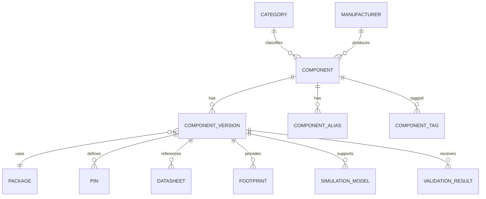
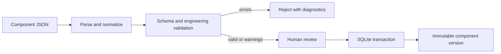
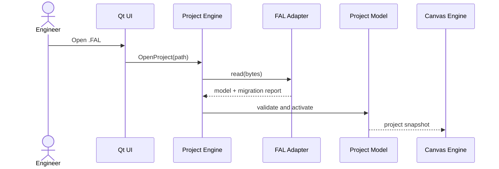
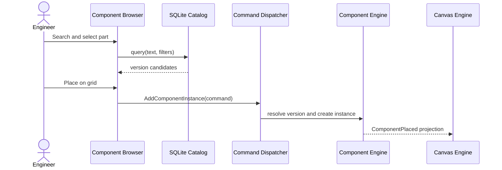
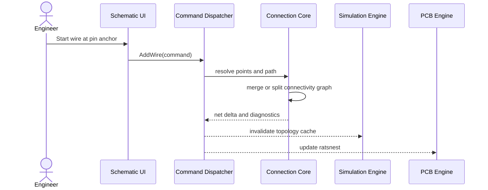
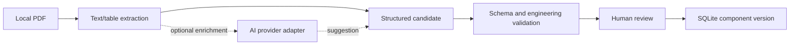

# ArduLab Software Architecture Document v1.0

**Project:** ArduLab (Arduino Laboratory)  
**Product:** Offline-first Electronic Design Automation platform  
**Target:** Windows desktop  
**Baseline:** `ArduLab_v0.1.0_Foundation.zip`  
**Status:** Architecture baseline and forward design  
**Date:** 2026-03-10

---

## 0. Executive Summary

ArduLab is intended to become an offline-first engineering environment connecting component selection, electrical connectivity, schematic capture, simulation, firmware generation, PCB design, and manufacturing output in one project model. It is not only a component viewer and not only a circuit drawing tool.

The supplied foundation establishes the direction through a Qt desktop target, an A3 canvas, a `.FAL` JSON project file, component JSON resources, geometry/view concepts, and declared Core, Canvas, Component Engine, and Connection Core source boundaries.

The production direction is a **modular desktop monolith with explicit ports and adapters**: one Windows process initially, but domain models and engines must not be coupled to `MainWindow`, `QGraphicsItem`, a specific database driver, solver, or AI provider. SQLite becomes the internal component catalog; JSON remains import/export; `.FAL` remains the project integration contract.

### Evidence boundary

The archive is a partial source distribution. `CMakeLists.txt` references a `src/` tree, but the archive contains no `src/` directory, C++ implementation files, or `ArduLab.exe`. Therefore:

1. Facts from `CMakeLists.txt`, build metadata, `.FAL`, JSON resources, and checked-in documents are verified against the archive.
2. Runtime behavior, class members, ownership, signal/slot wiring, serialization code, and actual dependency direction cannot be verified.
3. The target architecture is design direction, not proof of existing implementation.

This deliverable makes no application-code changes, database changes, rebuilds, or live AI integrations.

---

## 1. Scope, Goals, and Principles

### Scope

This document defines the current foundation evidence, target module architecture, C4 views, database direction, `.FAL` compatibility, end-to-end data flow, roadmap, risks, and implementation sequencing.

### Goals

- Preserve stable foundation modules and extend rather than rewrite them.
- Establish canonical electrical relationships before schematic, simulation, and PCB work.
- Keep project editing and component lookup useful without a network connection.
- Scale toward professional EDA workflows without turning `MainWindow` into a God object.
- Make outputs traceable to a project revision.
- Keep AI optional, provider-agnostic, auditable, and unable to silently mutate a project.

### Principles

1. Modular architecture and explicit ownership.
2. Dependency inversion around stable domain contracts.
3. One source of truth for connectivity.
4. Millimeters are authoritative; display scale is rendering state.
5. Explicit schema, component, and project versioning.
6. Human review for imported, AI-suggested, and manufacturing data.
7. Backward-compatible `.FAL` evolution.
8. Offline-first behavior by default.

---

## 2. Current Foundation Assessment

### 2.1 Evidence inventory

| Artifact | Verified information | Confidence |
|---|---|---:|
| `CMakeLists.txt` | Target, C++ standard, Qt modules, declared source/header paths, Windows flag | High |
| `build/CMakeCache.txt` | Prior Windows/MinGW/Ninja configuration and Qt paths | High |
| `AutogenInfo.json` | Qt6 autogen configuration and source/include roots | High |
| `Example_Project.FAL` | Current JSON project envelope | High |
| `resources/components/*.json` | Resource examples and schema variation | High |
| Upgrade/geometry documents | Intended features and architecture claims | Medium; documentation only |
| `src/**/*.cpp`, `src/**/*.h` | Not present in supplied archive | Unavailable |
| `ArduLab.exe`, object files, SQLite database | Not present in supplied archive | Unavailable |

### 2.2 Version observations

The archive carries several version signals: archive/project naming `v0.1.0`, upgrade notes for v0.1.2/v0.1.2.1, CMake project version `0.1.4`, and the requested next phases v0.1.3/v0.1.4. These need one release/version policy before the next tag; this is a governance issue, not proof of a runtime defect.

### 2.3 Verified technology baseline

The manifest declares C++17, CMake 3.16 minimum, Ninja, Qt6 `Core`, `Widgets`, `Gui`, and `Sql`, automatic Qt MOC/RCC/UIC, `src` as include root, and `WIN32_EXECUTABLE TRUE`. Build metadata shows a Windows MinGW-w64 UCRT64/GCC 16.2 toolchain.

Qt SQL is linked, but no SQLite schema, database file, migration, repository, or SQL implementation is present. SQLite is a target direction, not a verified current feature.

### 2.4 Declared module inventory

The only available implementation inventory is the CMake manifest:

- **Application:** `main.cpp`, `app/MainWindow.cpp/.h`.
- **Core:** `ProjectEngine`, `FileManager`, `EventSystem`, `Constants`, `Types`.
- **Canvas:** `A3CanvasScene`, `A3CanvasView`, `ComponentGraphicsItem`, `CoordinateSystem`, `Grid/SnapSystem`, `Rendering/LODController`, `Rendering/ViewMode`.
- **Component Engine:** `ComponentModel`, `ComponentDatabase`, `PackageModel`, `PinSystem`, `GeometryEngine`, `PinAnchorSystem`, `ComponentRenderer`, `PropertySystem`.
- **Connection Core:** `ConnectionCore`, `WireGraphicsItem`, `WireObject`, `NetObject`.

This indicates an emerging modular layout but does not prove compile-time or runtime enforcement.

### 2.5 Persistence evidence

The shipped `.FAL` file is:

```json
{
  "project": {"name": "Example Project", "version": "0.1"},
  "components": []
}
```

This proves only a minimal project metadata/component envelope. It does not prove serialized canvas, wires, nets, schematic, simulation, PCB, or manufacturing sections.

The resource schemas vary: ESP32 has visual data and pins; resistor has a value; LED has only ID/name/class. Upgrade notes describe a richer intended schema with manufacturer, part number, electrical data, communication, package, and pin metadata. That schema must become a versioned contract before SQLite activation.

---

## 3. System Architecture

### 3.1 Long-term workflow

```text
Component Library → Connection Core → Schematic Engine → Simulation Engine
       → Firmware Generation → PCB Engine → Manufacturing Output
```

The same component, pin, package, footprint, and net identities must survive transitions between representations.

### 3.2 C4 Level 1 — Context



### 3.3 C4 Level 2 — Containers



### 3.4 Dependency direction

```text
Qt UI / Graphics / File adapters / Provider adapters
                         ↓
Application services and commands
                         ↓
Domain engines and domain models
                         ↓
Stable IDs, units, value types, validation
```

- Domain engines do not depend on `MainWindow`.
- Domain models do not depend on `QGraphicsItem`.
- A renderer reads a model; the model does not know its renderer.
- Simulation, PCB, and Manufacturing consume Connection Core and do not create parallel net models.
- Events communicate completed changes; direct cross-module widget calls are avoided.

### 3.5 Offline-first behavior

SQLite lookup, project editing, validation, and `.FAL` save/open work without a network. Optional providers report unavailable status without blocking the editor. Datasheets may be local files with hashes; remote URLs are references, not required runtime dependencies.

---

## 4. Module Architecture and Relationships

### 4.1 Core Engine

Owns project lifecycle, IDs, revisions, commands, undo/redo coordination, event bus, file paths, and serializer coordination. It must not own graphics, SQL query details, solver code, or widget layout.

### 4.2 Canvas Engine

Owns the A3 workspace, physical-to-visual conversion, pan/zoom/grid/snap, LOD, view modes, selection, and visual delegates. It is a projection and interaction surface, not the source of truth for components, wires, or nets.

### 4.3 Component Engine

Owns library identity, component versions, package/physical geometry, pins, anchors, properties, JSON interchange, and SQLite access. Engineering, Symbol, Footprint, and Microscope views are representations of the same definition.

Component ID format:

```text
CATEGORY-ID-VARIANT-PART-PACKAGE
```

Examples: `MCU1-A-STM32F401-QFN48`, `MMCU1-A-ESP32-WROOM32`, `R1-A-0805-10K`, `C1-A-0603-100nF`, `DZ1-A-ZENER`, `DS1-A-SCHOTTKY`, `DF1-A-FAST`, `DE1-A-ESD`.

Library ID, component-version ID, project instance ID, and reference designator must remain separate.

### 4.4 Connection Core

Owns pin references, connection points, wire paths, junctions, net identity, merge/split operations, and connectivity diagnostics. Canonical relationship:

```text
ComponentInstance → PinReference → ConnectionPoint → WireSegment → Net
```

`WireGraphicsItem` is only a projection of `WireObject`.

### 4.5 Schematic Engine

Owns symbol placement, wire editing, junctions, net labels, power directives, annotation, ERC, and schematic commands. It consumes Component Engine symbols/pins and writes connectivity through Connection Core.

### 4.6 Simulation Engine

Owns topology preparation, model registry, solver scheduling, result snapshots, and diagnostics. Stage support: R/C/L/diode, then sensor/relay/motor/IC behavior, then Arduino/ESP32/STM32 co-simulation. Unsupported models must be explicit.

### 4.7 Firmware Services

Maps MCU pins/peripherals to Arduino, ESP-IDF, or STM32 project fragments. Generated code is a derived artifact with input revision and generator version; hand-edited source is never silently overwritten.

### 4.8 PCB Engine

Owns footprints, board outline/layers, placement, ratsnest, routing, DRC, zones/vias, and Gerber/drill export. It consumes footprints from Component Engine and nets from Connection Core.

### 4.9 Manufacturing Engine

Owns BOM grouping, supplier/manufacturer mapping, pick-and-place, assembly documents, and production manifests. All outputs link to a validated project revision.

### 4.10 AI Engine

Future, provider-agnostic capabilities include datasheet extraction, component JSON proposals, design explanations, code proposals, and error interpretation.

```text
AI Orchestrator
  ├── task policy and context builder
  ├── structured-output validator
  ├── confidence and provenance tracker
  └── ProviderPort
        ├── Local LLM adapter
        ├── OpenAI-compatible adapter
        └── Other provider adapter
```

AI output is a proposal requiring review and validation. **LIVE AI INTEGRATION IS NOT IMPLEMENTED; IT IS MOCKED/UNIMPLEMENTED BY DESIGN.**

### 4.11 UML relationship



---

## 5. Technology Stack

| Area | Decision | Rationale |
|---|---|---|
| Language | C++17 now; C++20 when policy/toolchain stabilize | Native Windows performance and Qt compatibility |
| UI | Qt6 Widgets and Graphics View | Matches foundation and dense engineering workflows |
| Build | CMake + Ninja | Reproducible Windows builds |
| Database | SQLite behind repository adapter | Embedded, transactional, offline-first |
| Project data | JSON in `.FAL` with explicit versions | Portable and migratable |
| Geometry | Millimeters authoritative; renderer scale separate | Prevents display scale errors |
| Platform | Windows first | Requested target and existing build metadata |
| AI | Provider-neutral ports | Local, OpenAI-compatible, and other adapters later |
| Simulation | Internal solver plus SPICE/co-simulation adapters | Incremental capability without solver lock-in |

Qt should be concentrated at UI, graphics, JSON, SQL, and application adapters. Core domain models should use explicit C++ value types where that reduces coupling.

---

## 6. Database Design

### 6.1 Storage direction

Current resources are JSON and current `.FAL` is JSON. Qt SQL is linked but no database implementation is supplied. Future SQLite is the internal component catalog; JSON remains import/export; `.FAL` stores project instances and exact catalog references.

### 6.2 Entities

| Entity | Purpose |
|---|---|
| Component | Logical part identity |
| ComponentVersion | Immutable/reproducible definition revision |
| Category | Taxonomy and hierarchy |
| Manufacturer | Normalized manufacturer identity |
| Package | Physical package/module, dimensions, pin count |
| Pin | Number, name, type, direction, side, anchors |
| Datasheet | Local/remote reference, hash, revision, provenance |
| Footprint | PCB land pattern and outline |
| SimulationModel | Model type, parameters, solver compatibility |
| ValidationResult | Rule, severity, message, timestamp |
| ComponentAlias / ComponentTag | Search and filtering |

### 6.3 Database rules

- Separate library definitions from project instances.
- Retain historical versions referenced by projects.
- Normalize query-critical fields; use JSON only for extensible payloads.
- Enable foreign keys, prepared statements, transactions, and migration backups.
- Validate package pin count, numbering, footprints, and simulation references before activation.
- Store content hashes and import provenance.

### 6.4 ER diagram



### 6.5 Import flow



---

## 7. `.FAL` Data Model and Compatibility

### 7.1 Identity separation

Library ID identifies a reusable definition. Component-version ID identifies the exact catalog revision. Instance ID identifies a placed occurrence such as `U1`. A pin reference combines instance and pin number. Net ID identifies a project electrical relationship. Project revision identifies the design state used for outputs.

### 7.2 Compatibility rule

The current minimal `.FAL` must open. Missing future sections are empty defaults, not fatal errors. Migrations preserve instance IDs, net IDs, millimeter coordinates, and unknown fields where safe.

Target direction, not an implementation change in this phase:

```json
{
  "fal_format_version": "1.0",
  "project": {"id": "project-uuid", "name": "Example Project", "version": "0.1"},
  "canvas": {"width_mm": 420.0, "height_mm": 297.0, "grid_mm": 1.0, "visual_scale": 10.0},
  "library": {"catalog_version": "", "component_references": []},
  "components": [],
  "connections": {"points": [], "wires": [], "nets": []},
  "schematic": {}, "simulation": {}, "firmware": {}, "pcb": {}, "manufacturing": {},
  "user_notes": []
}
```

### 7.3 Format adapter contract

```text
read(bytes) -> ProjectModel + MigrationReport
write(ProjectModel, targetVersion) -> bytes
canRead(version) -> bool
migrate(ProjectModel, fromVersion, toVersion) -> ProjectModel
validate(ProjectModel) -> ValidationReport
```

Save should use a temporary file, flush, atomic replace, recovery copy, and migration warnings. Display scale must never alter physical coordinates.

---

## 8. Data Flow

### 8.1 Open project



### 8.2 Insert component



### 8.3 Create net



### 8.4 Future AI datasheet flow



### 8.5 Manufacturing flow

```text
Validated project revision → PCB/connectivity validation → Manufacturing Engine
→ BOM + pick-and-place + Gerber/drill + assembly documents
→ output manifest with source revision and tool versions
```

---

## 9. Development Roadmap

| Phase | Target | Scope | Exit criteria |
|---|---:|---|---|
| 1 | v0.1.3 | SQLite Component Database, manager, search, categories, manufacturers, datasheets, versioning, validation, JSON import/export | Existing resources load through compatibility path; imports are transactional and searchable |
| 2 | v0.1.4 | Connection Core: pin objects, points, wires, nets, IDs, graph operations, serialization | Pin-to-pin wire creates stable net and round trips through `.FAL` |
| 3 | v0.2 | Schematic placement, wire editing, junctions, labels, ERC, command history | Schematic and canvas share pins/nets; ERC is actionable |
| 4 | v0.25 | Provider-neutral AI datasheet import, candidate JSON, validation, provenance, approval | AI is optional; uncertain output cannot mutate catalog |
| 5 | v0.3 | Basic R/C/L/diode solver, behavior registry, MCU co-simulation direction | Supported circuits produce traceable results; unsupported models are explicit |
| 6 | v0.5 | Footprints, placement, routing, DRC, Gerber | Board connectivity and footprint maps validate before export |
| 7 | v0.6 | BOM, pick-and-place, assembly docs, production manifest | Outputs agree on references, quantities, positions, and revision |
| 8 | v1.0 | Integrated workflow, migrations, reproducible outputs, packaging, recovery | Full workflow works offline on Windows with release governance |

AI follows schema and validation stabilization so it cannot become a second schema authority.

---

## 10. Risk Analysis

| Risk | Impact | Mitigation |
|---|---|---|
| Source tree absent | Runtime/class claims cannot be verified | Obtain complete source; label evidence levels |
| `MainWindow` becomes a God object | Fragile UI and slow work | Thin composition root, commands, services, events |
| Multiple net models | Schematic/simulation/PCB disagreement | Connection Core is canonical |
| `.FAL` incompatibility | Existing projects fail or change meaning | Versions, migrations, fixtures, atomic save |
| JSON schema drift | Import/rendering failures | Versioned schema and validator |
| Library updates alter old designs | Non-reproducible output | Immutable versions and content hashes |
| Unit/scale leakage | Incorrect physical output | Millimeters authoritative |
| AI hallucinated electrical data | Unsafe designs | Provenance, confidence, validation, approval |
| Solver scope outruns quality | Misleading simulation | Capability matrix and golden circuits |
| SQLite migration failure | Catalog loss/unavailability | Transactions, backups, integrity tests |
| Windows packaging gaps | Installation failure | Repeatable deployment and clean-machine test |
| Long jobs block UI | Hangs and poor usability | Worker jobs, cancellation, progress |
| Version drift | Ambiguous releases | One policy and consistency check |

---

## 11. Implementation Plan

This is an architecture-level plan only; it does not authorize source changes in this documentation phase.

### Phase 0 — Complete baseline capture

**New artifacts:** complete `src/` snapshot, authoritative version source, golden `.FAL` fixtures, component JSON schema, and ADR index. **Verification:** clean Windows build, example open/save round trip, component load test, and actual `MainWindow` ownership review.

### Phase 1 — Component Database Stabilization

**Expected new areas:** `ComponentEngine/Database` (connection, repositories, migrations), `ComponentEngine/Import` (JSON importer/exporter/schema validator), and `ComponentEngine/Validation`.

**Expected modified areas:** component version/provenance fields, database facade, project library references, CMake source list, and SQLite packaging if required.

**Dependencies:** SQLite/Qt SQL, versioned JSON schema, migration fixtures.

**Regression risks:** legacy JSON omissions, ID mismatch, and renderer assumptions. Mitigate with a compatibility normalizer and parity tests before removing legacy loading.

### Phase 2 — Connection Core

**Expected areas:** `PinReference`, `ConnectionPoint`, `WireObject`, `NetObject`, `ConnectivityGraph`, `ConnectivityValidator`, and commands. **Dependencies:** component instance IDs, physical coordinates, command/event contracts. **Risks:** moving anchors, duplicate visual/electrical wire sources, and net ID invalidation; use deterministic merge/split tests.

### Phase 3 — Schematic Engine

**Expected areas:** `SymbolModel`, `SchematicDocument`, `JunctionModel`, `NetLabelModel`, `ErcEngine`, and commands. **Dependencies:** symbols, Connection Core, Canvas, undo/redo. Test symbol and engineering views against identical pin identities.

### Phase 4 — AI Datasheet Import

**Expected areas:** `AiProviderPort`, `AiOrchestrator`, `DatasheetExtractionTask`, `StructuredOutputValidator`, `ProvenanceRecord`, and Local LLM/OpenAI-compatible/other adapters. Use timeouts, provider-neutral DTOs, offline fallback, confidence thresholds, and approval.

### Phase 5 — Simulation Engine

**Expected areas:** `SimulationDocument`, `ModelRegistry`, `CircuitTopologyBuilder`, `SolverPort`, `BasicSolver`, `SpiceAdapter`, and `McuCoSimulationAdapter`. Use capability matrices, golden circuits, convergence diagnostics, and result provenance.

### Phase 6 — PCB Engine

**Expected areas:** `BoardModel`, `LayerStack`, `FootprintModel`, `PlacementEngine`, `RoutingEngine`, `DrcEngine`, and `GerberExporter`. Validate footprint pin maps and run DRC before export.

### Phase 7 — Manufacturing Engine

**Expected areas:** `BomGenerator`, `PartSubstitutionService`, `PickAndPlaceExporter`, `AssemblyDocumentGenerator`, and `ManufacturingManifest`. Add deterministic cross-file consistency checks.

### Cross-cutting practices

- Define domain contracts before UI controls.
- Deliver one vertical slice per phase.
- Keep commands serializable where practical.
- Run parsing, validation, and simulation off the UI thread.
- Make expensive work cancellable and observable.
- Trace every output to project revision and tool version.
- Use capability registries for incomplete engines.

---

## 12. Quality and Testing Strategy

| Layer | Required coverage |
|---|---|
| Domain | IDs, units, coordinates, pin types, version comparison |
| Geometry | A3 dimensions, mm/visual scale, anchors, snap |
| Format | Legacy open, migration, round trip, unknown fields |
| Catalog | Migrations, constraints, search, import validation, version retention |
| Connectivity | Wire merge/split, junctions, labels, pin-to-net graph |
| Engines | ERC, solver topology, footprint maps, DRC |
| Adapters | JSON, SQLite, SPICE, firmware, Gerber/BOM/PnP |
| UI/recovery | Placement, view switching, save/open, malformed data, unavailable provider, cancellation |

Required fixtures include the current minimal `.FAL`, legacy component JSON, known millimeter placement, a two-pin wired resistor, a multi-pin MCU module, missing optional metadata, a retired component version, and malformed project/component definitions.

An engine is complete only when it has stable IDs, validation, versioned persistence, boundary tests, explicit unsupported states, and no private-object reach-through from another engine.

---

## 13. Architectural Governance

No stable module is modified without explicit approval. Every feature proposal must list modified files, new files, dependencies, regression risks/tests, `.FAL` impact, and migration/rollback plan.

Create an ADR before changing IDs, making a breaking `.FAL` change, creating a second connectivity representation, adding solver/provider dependencies, introducing plugins/workers, changing threading, or dropping/reinterpreting persisted data.

Review checklist:

- Correct engine and ownership?
- Second source of truth introduced?
- Units and IDs explicit?
- Offline path preserved?
- `.FAL` backward compatibility preserved?
- Testable without Qt UI?
- Providers optional and replaceable?
- `MainWindow` still a composition root?

---

## 14. Deliverable Change Record

| Category | Result |
|---|---|
| Modified application files | None |
| New application files | None |
| New documentation | `ArduLab Software Architecture Document v1.0.md` |
| New runtime dependencies | None |
| Database changes | None |
| AI integrations | None; **MOCKED/UNIMPLEMENTED BY DESIGN** |
| Build or refactor | None |
| Main documentation risk | Target boundaries cannot be source-verified until the missing `src/` tree is supplied |

### Supplied archive boundary

Present: build scripts, `CMakeLists.txt`, upgrade/geometry/architecture notes, one `.FAL` example, three component JSON resources, and CMake/Qt build metadata. Absent: `src/`, C++ source/header implementation, UI/resource files, executable, SQLite schema, and database.

The next source-level review should use a complete source archive or repository checkout. This document is both the v1.0 architecture baseline and the evidence boundary for that review.
