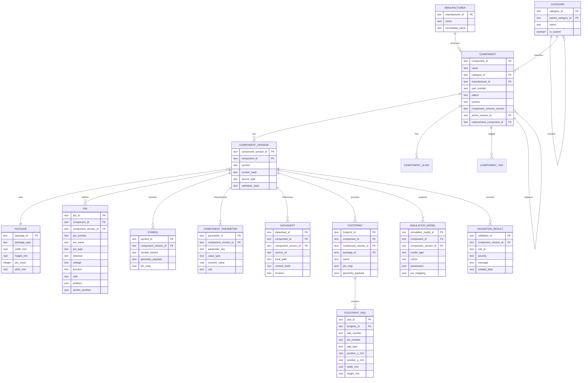
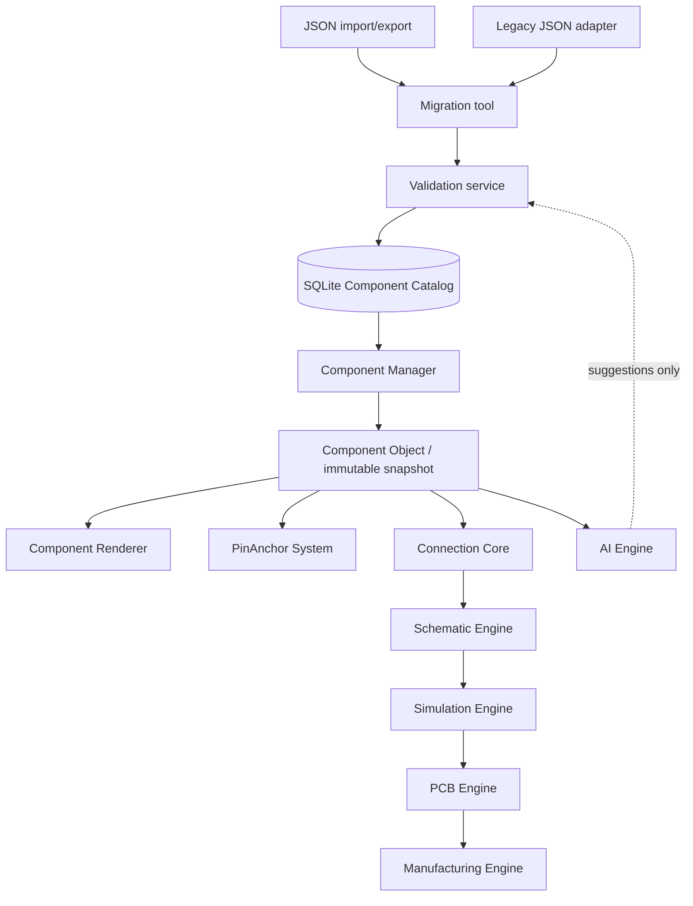

# ArduLab v0.1.3 Catalog Architecture Decision Record (ADR) v1.0

**Status:** Accepted — architecture consistency review complete; implementation approval recorded  
**Decision scope:** Component Catalog / Component Database  
**Target release:** v0.1.3  
**Baseline:** ArduLab v0.1 Foundation and *ArduLab Software Architecture Document v1.0*  
**Platform:** Windows desktop  
**Technology:** C++17/C++20, Qt6, CMake + Ninja, SQLite, JSON, `.FAL`  
**Implementation authorization:** Not granted; approval is required before coding

---

## 0. Decision Summary

ArduLab will use a local SQLite database as the authoritative internal catalog for component definitions and their versioned engineering metadata.

JSON remains the interchange boundary:

- Import format for component definitions.
- Export format for sharing and external tooling.
- Human-inspectable migration source and review artifact.

The `.FAL` file remains the authoritative project document. It stores project instances and exact references to catalog component versions; it does not become a second component catalog.

The catalog is the source of truth for **component information**. It is not the source of truth for project connectivity. Connection Core remains the source of truth for project pins, connection points, wires, and nets.

```text
SQLite Component Catalog
          ↓
Component Manager
          ↓
Component Object / immutable snapshot
          ├── Component Renderer
          ├── PinAnchor System
          ├── Connection Core
          ├── Schematic Engine
          ├── Simulation Engine
          ├── PCB Engine
          ├── Manufacturing Engine
          └── AI Engine
```

No existing stable module is redesigned or replaced by this ADR.

---

## 1. Context and Constraints

### 1.1 Existing stable foundation

The following remain stable architectural boundaries:

- Core Engine
- Canvas Engine
- Component Engine
- Component Renderer
- PinAnchor System
- A3 engineering canvas
- JSON component resources
- `.FAL` project format

The catalog must integrate through contracts and adapters. It must not move database logic into the renderer, Canvas, `MainWindow`, or Connection Core.

### 1.2 Product constraints

- Windows desktop first.
- C++17 now, with C++20 permitted when the toolchain policy is approved.
- Qt6 application framework.
- CMake + Ninja build.
- Offline-first behavior.
- SQLite as the embedded catalog database.
- JSON as import/export.
- Backward compatibility with current `.FAL` projects.
- No mandatory network service.
- No live AI integration in v0.1.3.

### 1.3 Architectural invariants

1. A component library ID is not a project instance ID.
2. A component version is immutable after activation.
3. A project references an exact component version or records an explicit unresolved state.
4. Pin identity must remain stable for Connection Core.
5. A rendered component is a projection of catalog data, never the persisted authority.
6. Import, validation, activation, and migration are transactional operations.
7. Catalog changes cannot silently alter an existing project.

---

## 2. Decision 1 — Database Technology

### 2.1 Decision

Use SQLite as the internal Component Catalog database, accessed through a dedicated catalog/repository boundary owned by Component Engine.

SQLite is embedded in the Windows application and operates without a server, network, account, or cloud dependency.

### 2.2 Technology comparison

| Option | Strengths | Limitations for ArduLab | Decision |
|---|---|---|---|
| JSON files | Human-readable, easy to import/export, simple sharing | Weak querying, no referential integrity, difficult version history, poor concurrent access, inconsistent schemas | Keep for interchange, not internal authority |
| SQLite | Embedded, transactional, indexed queries, foreign keys, versionable, offline, supported by Qt SQL | Requires schema migrations and connection discipline | **Selected** |
| PostgreSQL/MySQL server | Strong relational features and multi-user scale | Requires service deployment, network, administration, and offline synchronization | Not appropriate for v0.1.3 |
| Document database | Flexible nested data and schema variation | Extra runtime dependency, weaker relational guarantees for pins/packages/versions, unnecessary operational surface | Not selected |
| In-memory-only catalog | Fast and simple runtime access | No persistence, no history, no reliable sharing or migration | Not selected |

### 2.3 Database location

The primary per-user catalog is stored at:

```text
%LOCALAPPDATA%\ArduLab\catalog\ardulab_catalog.sqlite3
```

Recommended supporting paths:

```text
%LOCALAPPDATA%\ArduLab\catalog\backups\
%LOCALAPPDATA%\ArduLab\catalog\imports\
%LOCALAPPDATA%\ArduLab\catalog\logs\
```

Rules:

- The database is user-owned and writable without administrator privileges.
- The application must create the directory if absent.
- Packaged JSON resources remain read-only seed/import assets.
- A project does not depend on a relative working directory to find the catalog.
- `.FAL` references include component version and content hash so a project can detect a missing or changed catalog record.
- A future portable/catalog-bundled mode may use a project-local catalog snapshot, but it is not required for v0.1.3.

### 2.4 Connection management

The future `CatalogConnection` boundary is responsible for:

- Opening the SQLite file during application/catalog service startup.
- Enabling foreign-key enforcement for every connection.
- Configuring a bounded busy timeout.
- Applying the approved journal/synchronous settings.
- Running schema version checks before repository access.
- Closing the connection during application shutdown.
- Preventing UI classes from creating ad hoc SQL connections.

Connection rules:

- One catalog service owns the primary connection lifecycle.
- Repository classes receive a catalog service/transaction boundary, not a raw path from the UI.
- SQL is prepared and parameterized.
- Database access remains on the connection's owning thread.
- Long imports and validation jobs run through a worker service with an explicitly owned connection or serialized catalog task queue.
- The Component Renderer and Connection Core consume typed component snapshots, not SQL rows.

### 2.5 Transaction strategy

| Operation | Transaction requirement | Failure behavior |
|---|---|---|
| Read/search | Consistent read where multiple queries form one result | Return a catalog error without changing state |
| JSON import | One transaction per component version import | Roll back the whole import on structural failure |
| Batch import | Explicit batch transaction with progress | Roll back failed batch unless user selects isolated-item mode |
| Activation | One transaction covering validation result and status change | Component remains in previous state |
| Migration | One transaction per migration step, with migration record | Roll back current step; restore backup if recovery is needed |
| Deprecation | Transaction covering status and replacement reference | No partial lifecycle change |
| Backup metadata | Transactionally record backup/migration metadata where possible | Preserve prior backup if metadata write fails |

The catalog must never expose a partially imported component version to Component Manager.

### 2.6 Backup strategy

Before schema migrations, catalog compaction, or destructive administrative actions:

1. Run an integrity check.
2. Checkpoint the write-ahead log if WAL mode is enabled.
3. Create a consistent SQLite backup in the `backups` directory.
4. Store timestamp, catalog schema version, application version, and checksum in backup metadata.
5. Retain a configurable number of recent backups.

For a migration failure:

- Roll back the active transaction first.
- Preserve the failed database for diagnostics.
- Restore the last verified backup only when integrity or migration recovery requires it.
- Never delete the only known-good catalog.

---

## 3. Decision 2 — Database Entity Design

### 3.1 Identity and version model

The catalog uses four separate identity concepts:

| Identity | Meaning | Example |
|---|---|---|
| `component_id` | Stable logical catalog identity | `MMCU1-A-ESP32-WROOM32` |
| `component_version_id` | Immutable catalog revision | `MMCU1-A-ESP32-WROOM32@1.0.0` |
| `instance_id` | Project-local placed occurrence | `U1` |
| `content_hash` | Canonical serialized content identity | SHA-256 or equivalent |

`component_id` remains stable across compatible metadata corrections. A new `component_version_id` is created for every accepted revision.

### 3.2 Components

| Field | Type direction | Required | Meaning / rule |
|---|---|---:|---|
| `component_id` | Text | Yes | Primary stable library ID; follows category/ID/variant/part/package convention |
| `name` | Text | Yes | Human-readable name |
| `category_id` | Text FK | Yes | References `categories` |
| `manufacturer_id` | Text FK | No | References `manufacturers`; unknown is allowed for DRAFT |
| `part_number` | Text | No | Manufacturer part number; required before OFFICIAL |
| `description` | Text | No | Human-readable engineering description |
| `status` | Enum text | Yes | DRAFT, VERIFIED, COMMUNITY, OFFICIAL, DEPRECATED |
| `version` | Text | Yes | Active semantic component version label |
| `component_schema_version` | Text | Yes | Component data contract version, initially `1.0` |
| `created_date` | UTC timestamp | Yes | First catalog creation |
| `updated_date` | UTC timestamp | Yes | Last metadata update |
| `active_version_id` | Text FK | No | Current approved immutable version |
| `content_hash` | Text | Yes | Canonical content hash for reproducibility |
| `replacement_component_id` | Text FK | No | Required or recommended for DEPRECATED records where applicable |
| `catalog_scope` | Enum text | Yes | USER, COMMUNITY, or OFFICIAL ownership/source boundary |

`components` is the logical identity table. Mutable lifecycle metadata belongs here; immutable definition payloads belong in `component_versions` and related versioned records.

### 3.3 Component versions

Although the minimum requested component fields include `version`, a separate version table is required for reproducibility.

| Field | Meaning |
|---|---|
| `component_version_id` | Immutable revision primary key |
| `component_id` | Parent logical component |
| `version` | Semantic version for this definition |
| `component_schema_version` | Data contract version |
| `content_hash` | Canonical payload hash |
| `source_type` | MANUAL, JSON_IMPORT, LEGACY_IMPORT, AI_PROPOSAL, COMMUNITY |
| `source_reference` | File, URL, or provenance reference |
| `validation_state` | NOT_VALIDATED, PASSED, PASSED_WITH_WARNINGS, FAILED |
| `created_date` | Creation timestamp |
| `activated_date` | Activation timestamp, if activated |
| `created_by` | Local user/tool identity |

Unique constraint: `(component_id, version)`.

### 3.4 Categories

`categories` supports hierarchy through an optional `parent_category_id`.

Required initial categories:

```text
MCU
MCU_MODULE
PASSIVE
DIODE
ACTIVE
POWER
SENSOR
ACTUATOR
CONNECTOR
```

| Field | Meaning |
|---|---|
| `category_id` | Stable category code |
| `name` | Display name |
| `parent_category_id` | Optional hierarchy parent |
| `description` | Category meaning and constraints |
| `is_system` | Prevent accidental deletion of required categories |

Categories are extensible, but core codes must not be renamed without a migration and alias mapping.

### 3.5 Packages

| Field | Type direction | Meaning |
|---|---|---|
| `package_id` | Text PK | Stable package identity |
| `package_type` | Text | QFN, TQFP, MODULE, 0805, etc. |
| `width` | Real | Physical width in millimeters |
| `height` | Real | Physical height in millimeters |
| `pin_count` | Integer | Mechanical/electrical package pin count |
| `pitch` | Real | Pin pitch in millimeters, nullable for non-pinned parts |
| `unit` | Constant/metadata | `mm`; no implicit display units |
| `body_outline_ref` | Text/JSON reference | Optional geometry source |

Package geometry is physical data. Visual scale belongs to Canvas/Renderer and is not stored as engineering truth.

### 3.6 Pins

Pins are the critical catalog-to-Connection-Core boundary.

| Field | Type direction | Required | Meaning |
|---|---|---:|---|
| `pin_id` | Text PK | Yes | Stable pin record identity |
| `component_id` | Text FK | Yes | Required logical component reference |
| `component_version_id` | Text FK | Yes | Exact definition revision |
| `pin_number` | Text | Yes | Package pin number or pad identifier |
| `pin_name` | Text | Yes | Human-readable name, e.g. GPIO23 |
| `pin_type` | Enum/text | Yes | POWER, GROUND, GPIO, ANALOG, DIGITAL, NC, etc. |
| `direction` | Enum/text | Yes | INPUT, OUTPUT, INPUT_OUTPUT, POWER_IN, POWER_OUT, PASSIVE, NC |
| `voltage` | Text/structured value | No | Nominal/allowed voltage information |
| `function` | Text or list | No | Alternate functions such as I2C_SCL or PWM |
| `side` | Enum/text | Yes | LEFT, RIGHT, TOP, BOTTOM, or PACKAGE_DEFINED |
| `position` | Vector | Yes | Physical pin position in millimeters relative to package origin |
| `anchor_position` | Vector | Yes | Electrical connection point in millimeters |
| `electrical_rules` | Structured payload | No | Pull, drive, impedance, power, or special constraints |

Position convention:

```text
position.x_mm, position.y_mm
anchor_position.x_mm, anchor_position.y_mm
origin = package body origin
positive X = package right
positive Y = package down in engineering view
```

The exact screen orientation is a Renderer concern; the physical coordinate convention is catalog data. A pin without a trustworthy number or anchor cannot be activated for Connection Core use.

Connection Core references a catalog pin through the immutable tuple:

```text
CatalogPinRef = catalog_scope + component_id + component_version_id + pin_number
```

The catalog supplies pin identity, anchor geometry, pin type, direction, voltage limits, current limits, and electrical rules. Connection Core creates project-local `ConnectionPoint`, `Wire`, `Junction`, and `Net` objects from those references. Those project relationships remain in `.FAL`; they are not catalog rows.

### 3.7 Manufacturers

| Field | Meaning |
|---|---|
| `manufacturer_id` | Stable catalog identity |
| `name` | Official display name |
| `normalized_name` | Search/deduplication form |
| `website` | Optional reference URL |
| `country` | Optional metadata |
| `created_date` | Catalog creation timestamp |
| `updated_date` | Last metadata update |

### 3.8 Datasheets

| Field | Meaning |
|---|---|
| `datasheet_id` | Stable record identity |
| `component_id` | Logical component reference |
| `component_version_id` | Exact version supported by the document |
| `title` | Datasheet title |
| `source_uri` | Original URL or source reference |
| `local_path` | Optional local offline copy |
| `content_hash` | Local/source content hash |
| `revision` | Manufacturer document revision |
| `publication_date` | Optional source date |
| `extraction_status` | NOT_EXTRACTED, EXTRACTED, REVIEWED |
| `provenance` | Manual, manufacturer, import, or AI-assisted origin |

### 3.9 Footprints

| Field | Meaning |
|---|---|
| `footprint_id` | Stable footprint identity |
| `component_id` | Logical component reference |
| `component_version_id` | Version that owns the mapping |
| `name` | Footprint name |
| `package_id` | Package relationship |
| `source_format` | Internal, KiCad-compatible, imported, etc. |
| `pad_count` | Expected pad count |
| `geometry_payload` | Validated footprint geometry reference/payload |
| `pin_map` | Component pin to pad mapping |
| `validation_state` | Validation status |

### 3.10 Simulation models

| Field | Meaning |
|---|---|
| `simulation_model_id` | Stable model identity |
| `component_id` | Logical component reference |
| `component_version_id` | Exact supported version |
| `model_type` | SPICE, BEHAVIORAL, DIGITAL, MCU, etc. |
| `solver` | Compatible solver/adapter identifier |
| `source_reference` | Model file/source |
| `parameters` | Structured model parameters |
| `pin_mapping` | Model terminal to catalog pin mapping |
| `validation_state` | Model validation status |

### 3.11 Schematic symbols

| Field | Meaning |
|---|---|
| `symbol_id` | Stable symbol identity |
| `component_id` | Logical component reference |
| `component_version_id` | Exact supported component revision |
| `symbol_variant` | Default, alternate, unit, or gate variant |
| `geometry_payload` | Symbol primitives in schematic coordinates |
| `pin_map` | Symbol pin to catalog pin-number mapping |
| `validation_state` | Mapping/geometry validation status |

The catalog supplies symbol references and pin mappings. Schematic Engine owns placement, wires, junctions, labels, and ERC execution in the project. ERC consumes catalog pin type, direction, electrical rules, and Connection Core net membership.

### 3.12 Component parameters and electrical characteristics

Versioned `component_parameters` store typed engineering values needed by Simulation and ERC without parsing descriptions.

| Field | Meaning |
|---|---|
| `parameter_id` | Stable parameter identity |
| `component_version_id` | Owning component revision |
| `parameter_key` | Resistance, capacitance, inductance, forward voltage, tolerance, etc. |
| `value_type` | NUMBER, RANGE, ENUM, STRING, BOOLEAN |
| `numeric_value` / `minimum_value` / `maximum_value` | Normalized numeric representation where applicable |
| `unit` | SI/engineering unit |
| `text_value` | Non-numeric or source-preserving value |
| `source_reference` | Datasheet/provenance source |

Component-level electrical characteristics include supported supply range, absolute maximum ratings, current limits, power ratings, temperature range, and tolerance where applicable. Pin-level characteristics remain on the Pin record/electrical rules. Simulation Model parameters may override or bind catalog parameters explicitly but may not silently reinterpret their units.

### 3.13 Footprint pads

`footprint_pads` makes PCB pad information queryable and validatable instead of hiding all pad semantics in an opaque payload.

| Field | Meaning |
|---|---|
| `pad_id` | Stable pad identity within a footprint version |
| `footprint_id` | Owning footprint |
| `pad_number` | Package pad identifier |
| `pin_number` | Catalog pin mapping, nullable only for mechanical pads |
| `pad_type` | SMD, THROUGH_HOLE, NPTH, THERMAL, MECHANICAL |
| `shape` | RECT, ROUND, OVAL, CUSTOM, etc. |
| `position_x_mm` / `position_y_mm` | Position relative to footprint origin |
| `width_mm` / `height_mm` | Physical copper dimensions |
| `drill_mm` | Drill size when applicable |
| `layer_set` | Valid PCB layers |

PCB Engine receives package dimensions, footprint identity, complete pad geometry, and exact pin-to-pad mapping. It owns placement, board routing, vias, zones, and DRC project results.

### 3.14 Supporting tables

The catalog may also contain:

- `validation_results` — rule ID, severity, message, record, and timestamp.
- `component_aliases` — legacy IDs, distributor IDs, and search aliases.
- `component_tags` — user/community search tags.
- `catalog_metadata` — schema version, migration state, and catalog identity.

---

## 4. Entity Relationship Diagram



---

## 5. Database Relationship and Dependency Diagram

This diagram defines the runtime dependency direction. The catalog does not call the renderer, Connection Core, or downstream engines.



### Dependency rules

- `Component Manager` is the only approved application-facing catalog access boundary.
- Renderer receives read-only component snapshots.
- PinAnchor System receives physical pin/anchor data from the Component Object.
- Connection Core receives pin identity and anchor information; it owns project net state afterward.
- Schematic, Simulation, PCB, and Manufacturing consume stable catalog and connectivity contracts.
- AI may propose changes or enrich a candidate, but cannot bypass validation or activate a record.
- Schematic receives versioned symbol and pin-map references; project wires and junctions stay in Connection Core/`.FAL`.
- Simulation receives typed component parameters, electrical characteristics, model references, and terminal mappings.
- PCB receives package dimensions, footprint references, pad geometry, and exact pin-to-pad mappings.

---

## 6. Decision 3 — JSON Schema Strategy

### 6.1 Roles

| Format/store | Role |
|---|---|
| JSON | Import, export, sharing, review, migration input/output |
| SQLite | Internal searchable, relational, transactional catalog authority |
| `.FAL` | Project document containing instances, project connectivity, and exact catalog references |

JSON files are never treated as a live second catalog after successful import. The import result is a versioned SQLite record.

### 6.2 Version fields

Two levels are defined:

- `schema_version`: envelope/document format version.
- `component_schema_version`: canonical component domain contract version.

Required minimum example:

```json
{
  "schema_version": "1.0",
  "component_schema_version": "1.0",
  "component": {
    "component_id": "R1-A-0805-10K",
    "name": "10K Resistor",
    "category_id": "PASSIVE",
    "manufacturer_id": null,
    "part_number": null,
    "description": "10 kOhm resistor",
    "status": "DRAFT",
    "version": "1.0.0",
    "package_id": "0805",
    "pins": []
  }
}
```

The field `component_schema_version` is copied into the catalog record and is not inferred from a file name.

### 6.3 Schema evolution policy

- Minor schema versions may add optional fields without invalidating older importers.
- Major schema versions may rename, remove, or reinterpret fields and require a migration adapter.
- Every importer declares the schema versions it can read.
- Every exporter declares the target schema version it writes.
- Unknown fields are preserved in a provenance/raw payload where safe, or reported as loss during export.
- A schema version change requires fixtures, migration notes, and a compatibility review.
- Engineering units are explicit; dimensions are millimeters in the canonical schema.

### 6.4 Legacy field mapping

| Legacy field | Canonical field | Mapping rule |
|---|---|---|
| `id` | `component.component_id` | Preserve original ID; create alias if normalized ID is introduced |
| `name` | `component.name` | Direct copy |
| `class` | `component.category_id` | Map known values; unknown values become DRAFT with warning |
| `value` | `component.description` or typed attributes | Preserve value without losing original text |
| `visual.width` / `visual.height` | Package geometry candidate | Map only when unit/meaning is verified; otherwise preserve raw visual data and warn |
| `visual.scale` | Renderer metadata | Never use as physical engineering dimension |
| `pins[].name` | `pins.pin_name` | Direct copy |
| `pins[].type` | `pins.pin_type` | Map known types; unknown type produces warning |
| Missing `pin_number` | `pins.pin_number` | Do not invent numbers; record validation error for activation |
| Missing manufacturer/package/datasheet | Corresponding nullable record | Preserve as missing and apply lifecycle/validation rules |

The current ESP32 sample ID `MMCU1-A-ESP32-WROOM` must not be silently renamed to `MMCU1-A-ESP32-WROOM32`. If a canonical successor is created, the old ID becomes an alias or explicit replacement reference.

### 6.5 Stable ID migration policy

- A migration never rewrites `component_id` in place.
- Legacy IDs remain resolvable through `component_aliases`.
- A corrected canonical ID is a new logical component with an explicit replacement relationship.
- `component_version_id` is immutable after activation.
- Importing the same canonical content is idempotent by `(catalog_scope, component_id, version, content_hash)`.
- Conflicting content for an existing version is rejected; it is never silently merged.
- Pin numbers remain stable within a compatible version line. Renumbering pins is a major component version change.

### 6.6 JSON import/export contract

```text
JSON document
    → parse envelope
    → detect schema version
    → map legacy fields
    → normalize units and identifiers
    → validate candidate
    → user review when needed
    → transactional SQLite activation
```

Export reads from SQLite and emits a declared schema version. Export is not allowed to reconstruct data from the Renderer or Canvas.

---

## 7. Decision 4 — Migration Strategy

### 7.1 Migration path

```text
Old JSON Component
        ↓
Schema Detection
        ↓
Legacy Mapping / Migration Tool
        ↓
Canonical Component Candidate
        ↓
Validation
        ↓
Human Review if required
        ↓
SQLite Transaction
        ↓
Versioned Catalog Record
```

### 7.2 Migration numbering

Migrations are immutable, ordered, and recorded in `catalog_metadata`/`schema_migrations`.

| Migration | Scope | Result |
|---|---|---|
| `Migration_001` | Create `components` table and core catalog metadata | Logical component identity, requested component fields, catalog version state |
| `Migration_002` | Add `categories`, `manufacturers`, `packages`, and `pins` | Required taxonomy, package data, and Connection Core pin foundation |
| `Migration_003` | Add `validation_results` and validation state fields | Persisted structural/semantic validation outcomes |
| `Migration_004` | Add `datasheets`, `footprints`, and `simulation_models` | Downstream engineering references |
| `Migration_005` | Add `component_versions`, schema version, hashes, provenance | Immutable versioning and reproducibility |
| `Migration_006` | Add aliases, tags, search indexes, and lifecycle replacement references | Search and lifecycle operations |

The migration IDs are design identifiers. Actual migration files and implementation are not created by this ADR.

### 7.3 Upgrade process

1. Close or quiesce catalog writes.
2. Check database path and permissions.
3. Run integrity check.
4. Create a verified pre-migration backup.
5. Read current catalog schema version.
6. Apply pending migrations in numeric order.
7. Validate schema objects, foreign keys, required indexes, and row counts.
8. Record migration ID, checksum, application version, and timestamp.
9. Commit atomically.
10. Re-open through CatalogConnection and run a read/search smoke check.

### 7.4 Rollback strategy

SQLite migrations are forward-only in production; destructive down-migrations are not required.

If a migration fails:

- Roll back the active transaction.
- Keep the failed database and log for diagnosis.
- Restore the verified pre-migration backup when the database cannot be safely reopened.
- Mark the failed migration attempt without claiming success.
- Never run a guessed partial repair against user data.

Application releases must be able to open catalogs at their supported minimum schema version or provide a clear migration-required message.

### 7.5 Migration testing

Every migration must be tested against:

- Empty database.
- Previous release database.
- Database containing every lifecycle state.
- Database with component versions, pins, footprints, and validation results.
- Duplicate/invalid legacy data.
- Interrupted migration simulation.
- Repeated migration invocation for idempotency protection.
- Backup restore and post-restore integrity.
- Row-count, foreign-key, content-hash, and semantic data preservation.

---

## 8. Decision 5 — Component Validation System

### 8.1 Validation layers

#### Database layer

Enforces structural integrity:

- Required fields and types.
- Primary/foreign keys.
- Unique component IDs and version pairs.
- Unique pin number within a component version.
- Valid status values.
- Valid category/manufacturer/package references.
- Non-negative dimensions and valid numeric ranges.

#### Component Manager layer

Performs engineering semantics:

- Component ID and category convention.
- Package pin count versus defined pin count.
- Pin numbering and anchor completeness.
- Voltage range consistency.
- Footprint pad mapping.
- Simulation terminal mapping.
- Required metadata for lifecycle activation.

#### AI layer

AI output is treated as untrusted input:

- Parse only declared structured output.
- Validate against JSON schema.
- Run the same Component Manager validation rules.
- Preserve confidence and provenance.
- Never bypass ERROR rules.
- Require human review before activation.

### 8.2 Validation specification

| Rule ID | Severity | Description | Action |
|---|---|---|---|
| `VAL001` | ERROR | Pin voltage is incompatible with component operating voltage or declared domain | Reject activation; show affected pin and values |
| `VAL002` | WARNING | Footprint is missing | Allow DRAFT/COMMUNITY; block OFFICIAL/PCB export |
| `VAL003` | ERROR | Package pin count does not match defined physical pins | Reject activation |
| `VAL004` | WARNING | Datasheet is missing or has no provenance | Allow DRAFT; require review before OFFICIAL |
| `VAL005` | ERROR | Duplicate or missing pin number | Reject activation and Connection Core handoff |
| `VAL006` | ERROR | Pin anchor or position is missing/invalid | Reject activation for schematic/connection use |
| `VAL007` | ERROR | Component ID is missing, duplicated, or violates ID convention | Reject import/activation |
| `VAL008` | ERROR | Unknown category or invalid category relationship | Reject activation until mapped |
| `VAL009` | WARNING | Manufacturer or part number is missing | Allow DRAFT; block OFFICIAL status |
| `VAL010` | ERROR | Footprint pad map does not cover required pins exactly once | Reject PCB eligibility |
| `VAL011` | WARNING | Simulation model is missing | Allow catalog use; mark simulation unsupported |
| `VAL012` | ERROR | Simulation model pin mapping references unknown pins | Reject simulation eligibility |
| `VAL013` | ERROR | Physical dimensions or pitch are negative or outside package constraints | Reject activation |
| `VAL014` | WARNING | Legacy field was mapped with uncertainty | Keep DRAFT and require review |
| `VAL015` | ERROR | Canonical content hash does not match stored definition | Reject activation and mark record corrupt |
| `VAL016` | ERROR | Schema version is unsupported or migration is unavailable | Reject import with upgrade guidance |

Severity meanings:

- **ERROR:** record cannot activate at the required capability level.
- **WARNING:** record may remain DRAFT/COMMUNITY but requires review or limits downstream use.
- **INFO:** record is valid; advisory information may be shown without blocking.

### 8.3 Validation report

Each validation run records:

- `validation_id`.
- `component_version_id`.
- Rule ID.
- Severity.
- Human-readable message.
- Field/entity path.
- Observed value and expected constraint where safe.
- Validator version.
- Timestamp.
- Provenance of the input.

Validation results are immutable for an input revision. Revalidation creates a new report rather than overwriting history.

---

## 9. Decision 6 — Component Lifecycle

### 9.1 States

| State | Meaning | Allowed use |
|---|---|---|
| `DRAFT` | Imported or edited candidate not fully verified | Review, local experimentation; no official downstream guarantee |
| `VERIFIED` | Structural and engineering validation passed | Project use and supported downstream consumers |
| `COMMUNITY` | Shared/community contribution that passed baseline validation but is not official | User-selected use with provenance visible |
| `OFFICIAL` | Maintainer-approved, documented, reproducible catalog record | Default library and manufacturing/simulation eligibility |
| `DEPRECATED` | Retained for compatibility but not recommended for new designs | Existing projects remain readable; replacement is suggested |

### 9.2 Activation rules

- JSON import creates DRAFT.
- DRAFT becomes VERIFIED only when all required ERROR rules pass.
- COMMUNITY requires provenance and review status.
- OFFICIAL requires maintainer approval, complete required metadata, valid footprint policy, and documented datasheet provenance.
- A component with warnings may not become OFFICIAL unless the rule explicitly permits it and the warning is reviewed.
- Activation is transactional and creates an immutable `component_version_id`.

### 9.3 Versioning

Semantic version guidance:

- **Major:** pin identity, package, electrical meaning, or compatibility changes.
- **Minor:** additive functions, models, footprints, or non-breaking metadata.
- **Patch:** correction that preserves electrical and physical identity.

Every project reference records the exact version and content hash. Updating the active catalog version never silently updates an existing project.

### 9.4 Official, community, and user components

`catalog_scope` is separate from lifecycle status:

| Scope | Ownership and behavior |
|---|---|
| `OFFICIAL` | Maintainer-signed/approved catalog content; read-only to normal users; updates create new versions |
| `COMMUNITY` | Imported community content with visible provenance; may reach COMMUNITY status after validation/review |
| `USER` | Local custom component created or imported by the user; may be DRAFT or VERIFIED; fully exportable and versioned |

Rules:

- Custom user components are first-class catalog records and support the same package, pin, symbol, footprint, parameter, simulation-model, versioning, and validation contracts.
- A USER record cannot overwrite an OFFICIAL or COMMUNITY record with the same `component_id`; scope is part of lookup identity.
- Promotion from USER to COMMUNITY or OFFICIAL creates a reviewed record in the target scope and preserves provenance; it does not mutate the original.
- Search may include all scopes, but UI and API results must expose scope and lifecycle status separately.

### 9.5 Deprecation and replacement

- `DEPRECATED` records remain queryable and importable for old projects.
- New placement should show a deprecation warning.
- A replacement may be linked through `replacement_component_id`.
- Replacement is an explicit migration proposal, not an automatic substitution.
- Pin-map, package, footprint, and electrical compatibility must be validated before a replacement is suggested as compatible.

---

## 10. Decision 7 — Component Manager API Responsibilities

This section defines responsibilities only. It does not define C++ signatures or implement code.

### 10.1 Component Manager role

Component Manager is the application-facing service boundary between the catalog and stable/future modules.

Responsibilities:

- Load a component or exact component version.
- Search by ID, name, category, manufacturer, package, alias, and tags.
- Import a JSON candidate through the migration/validation pipeline.
- Export a canonical JSON definition.
- Validate a candidate or existing version.
- Activate, deprecate, and list versions according to lifecycle rules.
- Provide immutable component snapshots to Component Renderer.
- Provide pin and anchor data to Connection Core.
- Provide package, footprint, and simulation references to downstream engines.
- Expose provenance and validation reports.
- Never mutate a project directly.

### 10.2 Conceptual interface responsibilities

```text
load(component_id, version) → ComponentSnapshot
search(criteria) → ComponentSummary[]
list_versions(component_id) → ComponentVersionSummary[]
import_json(document) → ImportResult
export_json(component_version_id, schema_version) → JSONDocument
validate(component_version_id or candidate) → ValidationReport
activate(component_version_id, target_status) → ActivationResult
deprecate(component_id, replacement_id) → LifecycleResult
get_pins(component_version_id) → PinSnapshot[]
get_package(component_version_id) → PackageSnapshot
get_footprint(component_version_id) → FootprintSnapshot
get_simulation_model(component_version_id) → SimulationModelSnapshot
get_symbol(component_version_id, variant) → SymbolSnapshot
get_parameters(component_version_id) → ComponentParameterSnapshot[]
get_footprint_pads(footprint_id) → FootprintPadSnapshot[]
```

These are responsibility descriptions, not implementation code.

### 10.3 Dependency flow

```text
SQLite Repository / CatalogConnection
                ↓
Component Manager
                ↓
Component Object / immutable snapshot
        ┌───────┼────────┬───────────────┐
        ↓       ↓        ↓               ↓
    Renderer  PinAnchor  Connection Core  AI validation path
                            ↓
                 Schematic / Simulation / PCB
                            ↓
                     Manufacturing
```

The manager must not expose raw SQL rows or mutable shared database objects to consumers.

---

## 11. Decision 8 — Testing Strategy

### 11.1 Database loading test

**Fixture:** canonical `MMCU1-A-ESP32-WROOM32` component version.

**Expected:**

- Correct component ID and lifecycle state.
- Correct category `MCU_MODULE`.
- Correct package type and dimensions.
- Correct pin count and pin numbers.
- Correct pin names/functions.
- Correct voltage metadata.
- Correct datasheet reference and provenance.
- Correct footprint relationship or explicit missing-footprint warning.
- Stable content hash on repeated load.

The current shipped ESP32 JSON is a legacy/minimal fixture and lacks several of these fields. v0.1.3 must import it as DRAFT with warnings rather than claim that it already satisfies this test.

### 11.2 Migration test

Input: legacy component JSON with `id`, `name`, `class`, visual data, and incomplete pins.

Expected:

- Correct schema detection.
- Legacy fields mapped without data loss.
- Unknown fields preserved in provenance/raw payload where possible.
- Missing pin numbers are reported as `VAL005`, not invented.
- Record enters DRAFT.
- Re-running the migration does not create duplicate logical component IDs or duplicate versions without an explicit version change.

### 11.3 Database integrity tests

- Foreign keys reject orphan package, manufacturer, pin, and version rows.
- Duplicate component/version pairs are rejected.
- Duplicate pin numbers within one component version are rejected.
- Negative dimensions and invalid pitch are rejected.
- Activation is atomic: a failed validation does not change status.
- Backup restore passes integrity check.
- Migration checksums detect modified migration definitions.

### 11.4 JSON compatibility tests

- Import current minimal JSON.
- Import canonical schema `1.0`.
- Reject unsupported major schema versions with actionable diagnostics.
- Export schema `1.0` and re-import it without semantic drift.
- Preserve legacy IDs as aliases where normalized identifiers are introduced.
- Preserve millimeter coordinates and pin anchors.

### 11.5 `.FAL` compatibility tests

- Open the current minimal `Example_Project.FAL` unchanged.
- Open a `.FAL` with no catalog reference section.
- Open a `.FAL` referencing a catalog version that is present.
- Open a `.FAL` referencing a missing catalog version and show an unresolved/read-only diagnostic rather than substituting another component.
- Save a legacy project after catalog integration without losing project metadata or component instances.
- Verify exact component version/content hash is preserved through save/open.

The additive catalog reference contract is:

```json
{
  "catalog_scope": "OFFICIAL",
  "component_id": "MMCU1-A-ESP32-WROOM32",
  "component_version_id": "MMCU1-A-ESP32-WROOM32@1.0.0",
  "content_hash": "sha256:...",
  "fallback_snapshot": {
    "name": "ESP32-WROOM-32",
    "reference_prefix": "U",
    "package_id": "MODULE-38",
    "pin_numbers": ["1", "2"]
  }
}
```

The reference block is additive and optional, so legacy `.FAL` files remain valid. `fallback_snapshot` is a read-only recovery/display cache, not a second editable catalog. If the exact catalog version is unavailable, ArduLab opens the project with an unresolved-component diagnostic, preserves connectivity and instance IDs, and never substitutes another version automatically.

### 11.6 Connection Core contract tests

- Every activated pin has a stable pin number and anchor.
- Component Manager returns the same pin identity on repeated reads.
- Component Renderer and Connection Core receive equivalent snapshots.
- A package pin-count mismatch blocks Connection Core eligibility.
- A pin-number change creates a new incompatible component version rather than mutating an active one.

### 11.7 Future-engine contract tests

- Schematic resolves a symbol variant and maps every symbol pin to an immutable CatalogPinRef.
- Wire and junction edits change only Connection Core/`.FAL`, never catalog rows.
- ERC receives pin direction, pin type, voltage/current constraints, and net membership.
- Simulation receives typed parameters, electrical characteristics, model reference, and complete terminal mapping.
- PCB receives package dimensions, footprint identity, pad geometry, and complete pin-to-pad mapping.
- USER, COMMUNITY, and OFFICIAL records with identical human-facing names remain separately identifiable.
- A missing catalog record opens through the `.FAL` fallback snapshot without data loss or automatic substitution.

---

## 12. Final Future-Module Consistency Matrix

| Consumer | Required catalog contract | Catalog responsibility | Project/engine responsibility | Result |
|---|---|---|---|---|
| Connection Core | Pin references, anchors, electrical properties | Immutable CatalogPinRef, positions, anchor positions, type, direction, voltage/current rules | Connection points, wires, junctions, nets in `.FAL` | PASS |
| Schematic Engine | Symbol references, wire connectivity, junction/ERC inputs | Versioned symbols, symbol-to-pin map, electrical rule metadata | Placement, wire/junction/net-label editing, ERC execution | PASS |
| Simulation Engine | Parameters, models, electrical characteristics | Typed parameters, units, model reference, terminal mapping, voltage/current ratings | Topology construction, solving, results | PASS |
| PCB Engine | Footprint, package, pads | Package dimensions/pitch, footprint version, pad geometry, pin map | Placement, routing, vias/zones, DRC | PASS |
| `.FAL` compatibility | Stable external references | Resolve exact scope/ID/version/hash and aliases | Preserve instances/connectivity; unresolved safe-open | PASS |
| Custom content | User-defined components | USER scope, full schema, validation, versioning, export | User editing and project placement | PASS |
| Trust separation | Official/community/user distinction | Independent catalog scope plus lifecycle/provenance | UI filtering and disclosure | PASS |

---

## 13. Decision 9 — Architecture Review Checklist

Before v0.1.3 implementation approval:

- [x] SQLite database design complete.
- [x] Database location and backup policy defined.
- [x] Connection ownership and thread/connection rules defined.
- [x] JSON schema version fields defined.
- [x] Legacy JSON mapping defined for shipped resource shapes.
- [x] Migration numbering and rollback process defined.
- [x] Migration fixtures and testing plan defined.
- [x] Validation rule IDs, severity, and actions defined.
- [x] Validation boundaries assigned to Database, Component Manager, and AI import path.
- [x] Component lifecycle states and activation rules defined.
- [x] Component version/content-hash and stable-ID policy defined.
- [x] `.FAL` backward compatibility and unresolved-reference behavior defined.
- [x] Pin/anchor/electrical requirements support Connection Core.
- [x] Symbol/ERC, simulation, footprint, and pad contracts support future engines.
- [x] USER, COMMUNITY, and OFFICIAL catalog separation defined.
- [x] Stable Core, Canvas, Component Engine, Renderer, and PinAnchor modules remain unchanged by this ADR.
- [x] No database logic is assigned to `MainWindow`, Canvas, Renderer, or Connection Core.
- [ ] Complete source tree available for implementation-level file planning.
- [x] Architecture consistency review completed.

---

## 14. Implementation Readiness Assessment

### Decision

**Architecture readiness: PASS.** The catalog contract supports Connection Core, Schematic, Simulation, PCB, `.FAL` compatibility, custom user components, and trust/source separation. Implementation remains gated on the complete Qt6/C++ source tree and an explicit instruction to begin coding.

### Ready for approval review

- SQLite is selected with a clear offline rationale.
- Database location, connection ownership, transaction policy, and backup strategy are defined.
- Required component entities and pin/anchor data are defined.
- ER and dependency diagrams are included.
- JSON roles, schema version fields, evolution rules, and legacy mapping are defined.
- Migration numbering, upgrade, rollback, and testing strategy are defined.
- Validation layers and rule specifications are defined.
- Component lifecycle and immutable versioning are defined.
- Component Manager responsibilities and downstream dependency flow are defined.
- `.FAL` compatibility behavior is defined.

### Preconditions before coding

1. Approve this ADR and the associated Architecture Document v1.0.
2. Supply or confirm the complete Qt6/C++ source tree; the foundation archive previously inspected omitted `src/` implementation files.
3. Confirm the canonical component ID and versioning policy.
4. Confirm whether the v0.1.3 catalog is per-user only or must support a portable project-local snapshot.
5. Confirm the exact initial canonical ESP32 fixture, because the current sample lacks package, voltage, datasheet, and complete pin metadata.
6. Convert the checklist into implementation acceptance criteria.

### Explicit non-decisions

- No C++ classes are created by this ADR.
- No SQLite database file or migration file is created.
- No existing stable module is refactored.
- No AI provider is selected or integrated.
- No live data source is required.

---

## 15. Change Record

| Category | Result |
|---|---|
| New documentation | `ArduLab v0.1.3 Catalog Architecture Decision Record (ADR) v1.0.md` |
| Modified source files | None |
| New application code | None |
| New runtime dependencies | None |
| Database created | No |
| Migrations created | No; only the approved plan is documented |
| AI integration | **MOCKED/UNIMPLEMENTED BY DESIGN** |
| Implementation state | Waiting for architecture approval |

---

## 16. Approval Record

| Role | Name | Decision | Date |
|---|---|---|---|
| Architecture consistency review | E1 Architecture Review | Approved | 2026-03-10 |
| EDA/domain owner |  | Pending |  |
| Implementation owner |  | Pending |  |
